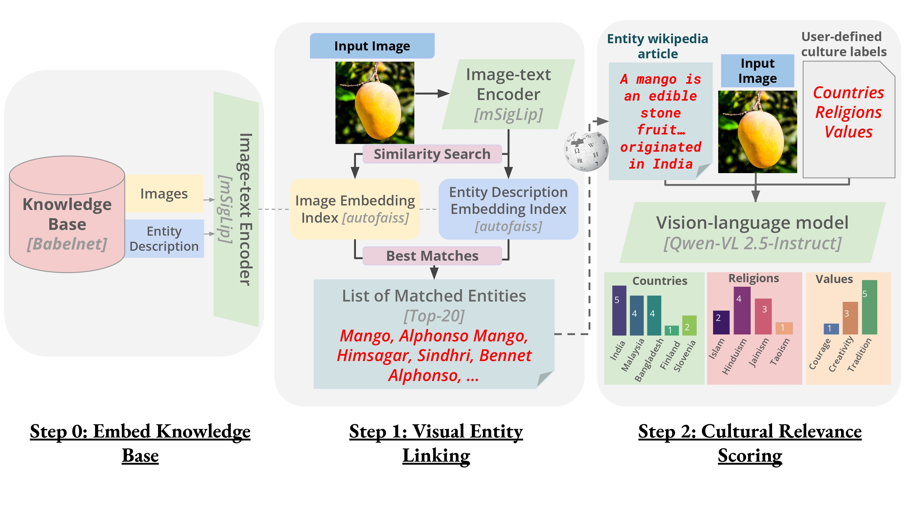

<div align="center">

# *CAIRE: Cultural Attribution of Images by Retrieval-Augmented Evaluation*

## Overview  

<p align="center">
  
</p>  

</div>

## Abstract

As text-to-image models become increasingly prevalent, ensuring their equitable performance across diverse cultural contexts is critical. While prompt-based interventions have been explored to mitigate biases, they often introduce factual inaccuracies or offensive content. Despite widespread recognition of these challenges [¹](https://tinyurl.com/yc5jjk64), there is no reliable metric to evaluate **cultural relevance** in generated images.  
To address this gap, we introduce **CAIRE**, a novel framework that assesses cultural relevance by grounding images to entities and concepts in a knowledge base for a user-defined set of free-text labels. On a synthetically constructed dataset of rare and culturally significant items (*synthetic*), built using proprietary models, CAIRE surpasses all baselines by **28% F1 points**.  

Additionally, we evaluate text-to-image (T2I) models by:  
- Generating images for culturally universal concepts (*concept-generated*)  
- Retrieving real-world images of the same concepts (*concept-natural*)  

CAIRE achieves Pearson’s correlations of **0.56** and **0.66** with human ratings on these sets, based on a 5-point Likert scale of cultural relevance. This demonstrates strong alignment with human judgment across diverse image sources.  

[Directory structure after setup and running the pipeline](#final-directory-structure)

## Installation & Setup  

### **Step 1: Clone the Repository**  
```sh
git clone https://github.com/siddharthyayavaram/CAIRE
cd CAIRE
```  

### **Step 2: Run the Setup Script** 

Run:  
```sh
python setup.py
```  

The setup script performs the following tasks:  
- **Creates necessary directories**: Ensures that the required folders (`data/`, `checkpoints/`, and `src/outputs/`) exist.  
- **Clones the `big_vision` repository**: Clones Google's [`big_vision`](https://github.com/google-research/big_vision) repository.  
- **Downloads model checkpoints (~4GB)**: Downloads pre-trained model checkpoints from Google Cloud Storage and stores them in the `checkpoints/` directory.  
- **Downloads dataset files (~31GB)**: Fetches various preprocessed datasets and lookup files, storing them in `data/`.  
- **Sets up a Conda environment**: Creates a conda environment `caire` from `environment.yaml`.

### **Step 3**: 
Once setup is complete, activate the Conda environment using:  
```bash
conda activate caire
```

---

## **Usage**  

### **Running CAIRE**  

- CAIRE processes datasets stored as folders of images. 
- An example dataset with five images is provided in `src/examples`.  
- The dataset name and various configurations are specified in `src/config.py`, including the base path (`BP`) and important parameters for retrieval and model processing.  

### **Configuration Details (`config.py`)**  

- **Paths**  
  - `BP`, `DATA_PATH`, and `OUTPUT_PATH` define the locations for input data and outputs.  

- **Retrieval & Indexing**  
  - `INDEX_INFOS`, `FAISS_INDICES`, and `LEMMA_EMBEDS` are paths used for image and text retrieval metadata.  
  - `BABELNET_WIKI` stores Wikipedia sources of the BabelNet entities.  
  - `RETRIEVAL_BATCH_SIZE` controls the batch size for retrieval.  

- **Model Parameters**  
  - `VARIANT`, `RES`, and `SEQLEN` specify model architecture settings.  
  - `CKPT_PATH` and `SENTENCE_PIECE_PATH` define the model checkpoint and tokenizer locations.  

- **Wikipedia Retrieval**  
  - `MAX_WIKI_DOCS` limits the number of Wikipedia documents retrieved per query image.  

- **Culture scoring**  
  - `PROMPT_TEMPLATE`
  - `TARGET_LIST` is the list of possible culture labels 

### **Running the Pipeline**  

Execute the following command to process the dataset:  

```sh
python -m src.main
```  

This processes images in `src/examples` and generates output files in `src/outputs`.  

### **Output Files**  

After running `src/main.py`, the following files will be created in `src/outputs/`:  

- **`{DATASET}_bids_match.pkl`** – Entity matching results  
- **`caire_{DATASET}_lemma_match.pkl`** – Lemma-based matching results  
- **`caire_{DATASET}_wiki.pkl`** – Wikipedia-based retrieval results  
- **`{DATASET}_image_embeddings.pkl`** – Image embeddings  
- **`1-5_{DATASET}_VLM_qwen.pkl`** – Final 1-5 scoring results  

### **Visualization**  

`eval/visualization.ipynb` shows the 1-5 scores and matched Wikipedia pages for the example images.

---
## Storage Requirements  

> [!IMPORTANT]
> Ensure you have sufficient disk space before proceeding:
- checkpoints/ requires **~4GB**
- data/ requires **~31GB**

---
## Final Directory Structure  

```
📂 CAIRE/                                              
│-- 📂 assets/                                
│-- 📂 eval/                                            # Evaluation-related files
│   ├── 📄 visualization.ipynb                          # Jupyter Notebook for visualization
│-- 📂 src/                                             # Source code directory
│   ├── 📂 examples/                                    # Sample images for testing (DATASET)
│   │   ├── 🖼️ eg1.jpg  
│   │   ├── 🖼️ eg2.jpg  
│   │   ├── 🖼️ eg3.jpg  
│   │   ├── 🖼️ eg4.jpg  
│   │   ├── 🖼️ eg5.jpg  
│   ├── 📂 models/                            
│   │   ├── 📄 model_loader.py                          # Model loading script  
│   ├── 📂 scripts/                                     # Core functionalities  
│   │   ├── 📄 culture_scores.py                        # Cultural score calculations  
│   │   ├── 📄 disambiguation.py                        # Lemma matching logic  
│   │   ├── 📄 fetch_wikipedia.py                       # Wikipedia data retrieval  
│   │   ├── 📄 retrieval.py                             # Entity retrieval
│   ├── 📂 outputs/                                     # Outputs from running the pipeline (main)
│   │   ├── 📄 {DATASET}_bids_match.pkl                 # Entity matching results
│   │   ├── 📄 caire_{DATASET}_lemma_match.pkl          # Lemma matching results
│   │   ├── 📄 caire_{DATASET}_wiki.pkl                 # Wikipedia-based retrieval results
│   │   │── 📄 {DATASET}_image_embeddings.pkl           # Image embeddings
│   │   │── 📄 1-5_{DATASET}_VLM_qwen.pkl               # Final 1-5 scores
│   ├── 📄 config.py                                    # Configuration settings  
│   ├── 📄 main.py                                      # Main script  
│   ├── 📄 utils.py                          
│
│-- 📂 checkpoints/                                     # Model checkpoints
│   ├── 📄 sentencepiece.model                
│   ├── 📄 webli_i18n_so400m_16_256_78061115.npz
│
│-- 📂 data/                                            # KB Metadata
│   ├── 📄 babelnet_source_dict.pkl                     # Wikipedia entities from BabelNet
│   ├── 📄 combined_lemma_embeds.pkl                    # Precomputed lemma embeddings
│   ├── 📂 faiss_index_merged/                          # FAISS index for retrieval
│   ├── 📄 index_infos_merged.json                      # Metadata corresponding to retrieval
│   ├── 📄 country_list.pkl                             # List of 10 populous, diverse countries
│
│-- 📂 big_vision/                                      # Cloned repository, helper functions to run mSigLIP
│
│-- 📄 README.md                              
│-- 📄 setup.py                                         # Installation script  
│-- 📄 environment.yaml                                 # Conda environment file

```  
