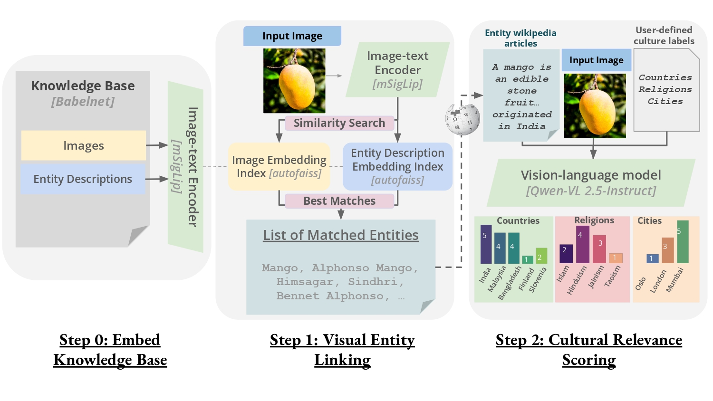

<div align="center">

# *CAIRE: Cultural Attribution of Images by Retrieval-Augmented Evaluation*

## Overview  

<p align="center">
  
</p>  

</div>

## Abstract

As text-to-image models become increasingly prevalent, ensuring their equitable performance across diverse cultural contexts is critical. 
Efforts to mitigate cross-cultural biases have been hampered by trade-offs, including a loss in performance, factual inaccuracies, or offensive outputs.
Despite widespread recognition of these challenges, an inability to reliably measure these biases has stalled progress. To address this gap, we introduce CAIRE, a novel evaluation metric that assesses the degree of cultural relevance of an image, given a user-defined set of labels. Our framework grounds entities and concepts in the image to a knowledge-base and uses factual information to give independent graded judgments for each culture label.
On a manually curated dataset of culturally salient but rare items built using language models, CAIRE surpasses all baselines by **28%** F1 points. Additionally, we construct two datasets for culturally universal concepts, one comprising of T2I generated outputs and another retrieved from naturally-occurring data. CAIRE achieves Pearson’s correlations of **0.56** and **0.66** with human ratings on these sets, based on a 5-point Likert scale of cultural relevance. This demonstrates its strong alignment with human judgment across diverse image sources.

---

## Installation and Setup

**Prerequisites:**  
- Python version 3.9 or later.

#### Step 1: Clone the Repository

```sh
git clone https://github.com/siddharthyayavaram/CAIRE.git
cd CAIRE
```

#### Step 2: Setup  

The setup process performs the following tasks:  

#### **1. Setting Up the Environment**  

1. Create a virtual environment:  
   ```sh
   python -m venv caire
   source caire/bin/activate
   ```  
2. Install dependencies:  
   ```sh
   pip install -e .
   ```  

#### PyTorch Installation

```sh
pip3 install torch torchvision torchaudio --index-url https://download.pytorch.org/whl/cu124
```

For further details regarding the installation of PyTorch, refer to the [official PyTorch guide](https://pytorch.org/get-started/locally/).

**Note:**  
If you are using an **Ampere GPU**, ensure that your CUDA version is **11.7 or higher**, then install **FlashAttention** with the following command:  

```sh
pip install flash-attn --no-build-isolation
```

#### **2. Additional Setup Functionality**

- Creates necessary directories: Ensures the existence of required folders (`data/`, and `src/outputs/`).
- Downloads dataset files (~31GB): Fetches preprocessed datasets and lookup files, storing them in `data/`.
- Downloads predefined target culture lists into `data/`:

    - `country_list.pkl`: A list of 177 countries
    - `top10_countries.pkl`: 10 countries selected based on annotator availability (population) and cultural diversity
    <!-- - - `Brazil, China, Egypt, Germany, India, Indonesia, Mexico, Nigeria, Russia, United States of America` -->
     ```sh
     ["Brazil", "China", "Egypt", "Germany", "India", "Indonesia", "Mexico", "Nigeria", "Russia", "United States of America"]
     ```
    - `indian_states.pkl`: A list of 28 Indian states, excluding Union Territories
    - `USA_states.pkl`: U.S. states
    - `common_religions.pkl`: Religions with the highest global population representation 
    <!-- - - `Christianity, Islam, Hinduism, Buddhism, Sikhism, Judaism, Atheism, Agnosticism` -->
    ```sh
    ["Christianity", "Islam", "Hinduism", "Buddhism", "Sikhism", "Judaism", "Atheism", "Agnosticism"]
    ```

#### Command

```sh
python setup.py download_assets
```

---

## **Usage**

### **Running CAIRE (CLI)**

#### **1. Configuration (`config.py`)**

* `DEFAULT_DATASET`: Fallback image folder (`src/examples/`).
* `DATA_PATH` / `OUTPUT_PATH`: Root folders for data files (`.pkl`, indices) and outputs.
* `PREDEFINED_TARGET_LISTS`: Paths to pickled lists (countries, states, religions) stored under `data/`.
* `INDEX_INFOS`, `FAISS_INDICES`, `LEMMA_EMBEDS`, `BABELNET_WIKI`: Retrieval/index artifacts.
* `RETRIEVAL_BATCH_SIZE`, `NUMBER_RETRIEVED_IMAGES`, `MAX_WIKI_DOCS`: batch sizes and number of retrieved items.
* `PROMPT_TEMPLATE`: Prompt for culture scoring.

#### **2. Entry Point (`main.py`)**

```sh
python -m src.main --target_list <TARGET_LIST> --image_paths <IMAGE_PATHS>
```

* `--target_list`

  * Default: `top10_countries.pkl` (located under `data/`).
  * If you input an existing `*.pkl` in `data/`, CAIRE treats it as a predefined list. e.g `indian_states.pkl`
  * To use custom labels, wrap a comma-separated string in quotes, e.g.

    ```sh
    --target_list "CultureA,CultureB,CultureC"
    ```

  You can add your own `.pkl` files to the `data/` folder, but to use them as predefined target lists, you must also add their paths to `PREDEFINED_TARGET_LISTS` in `config.py`.

* `--image_paths`

  * Must be either:

    * A single folder path (e.g., `data/image_folder`)
    * A space-separated list of image file paths (e.g., `img1.jpg img2.jpg img3.jpg`)

  * If a folder is passed, CAIRE processes all images inside.
  * If omitted, CAIRE defaults to the example folder in `config.DEFAULT_DATASET` (`src/examples/`).

* `args.timestamp`

   * Automatically set to the current timestamp (format: `YYYYMMDD_HHMMSS`, e.g., `20250531_143210`).
   * Used to append a unique prefix to all intermediate and final output files.

* `log_run_metadata(args)`

   * Appends a row to `src/outputs/run_log.csv` for every run, containing:

     * `timestamp` (e.g., `20250531_143210`)
     * `image_input_type` (`folder` or `list`)
     * `num_images` (integer)
     * `image_paths` (folder name or space-separated file paths)
     * `targets` (predefined target_list filename or comma-separated custom labels)


   All outputs are written under `src/outputs/`, with filenames prefixed by the timestamp.

---

#### **3. Output Files & Naming Conventions**

`src/outputs/` contains intermediate and final output files:

* `<TIMESTAMP>_bids_match.pkl`: Entity matching results (BabelNet ID matching).
* `<TIMESTAMP>_lemma_match.pkl`: Lemma-based disambiguation.
* `<TIMESTAMP>_wiki.pkl`: Retrieved Wikipedia Pages.
* `<TIMESTAMP>_image_embeddings.pkl`: Image embeddings.
* `1-5_<TIMESTAMP>_VLM_qwen.pkl`: Final 1–5 scoring results (Using `Qwen2.5-VL-7B-Instruct`).

For every run, check `run_log.csv` (in the same folder) to find which timestamp corresponds to which input parameters.

```  
| timestamp       | image_input_type | num_images | image_paths        | targets               |
|-----------------|------------------|------------|--------------------|-----------------------|
| 20250531_143210 | folder           | 125        | examples           | top10_countries.pkl   |
| 20250531_150005 | list             | 20         | /path/img1.jpg …   | "CultureA,CultureB"   |
```

---

#### **4. Examples**

1. Default image folder and target list
   (uses `data/top10_countries.pkl` and `config.DEFAULT_DATASET` (`src/examples/`).):

   ```sh
   python -m src.main
   ```

2. Specify a predefined target list (`indian_states.pkl`) and a folder of images

   ```sh
   python -m src.main --target_list indian_states.pkl --image_paths image_folder
   ```

3. Pass individual image files manually and a custom target list

   ```sh
   python -m src.main --target_list "CultureA,CultureB,CultureC" \
                      --image_paths image_folder/img1.jpg image_folder/img2.png
   ```

4. Using a custom `.pkl` target list you added under `data/`
   Suppose you created `data/custom_targets.pkl`. Then call:

   ```sh
   python -m src.main --target_list custom_targets.pkl --image_paths image_folder
   ```

---

### Visualization  

`eval/visualization.ipynb` shows the 1-5 scores and matched Wikipedia pages for the example images with default CAIRE parameters.

---
### Storage Requirements  

> [!IMPORTANT]
> Ensure you have sufficient disk space before proceeding:
- data/ requires **~31GB**